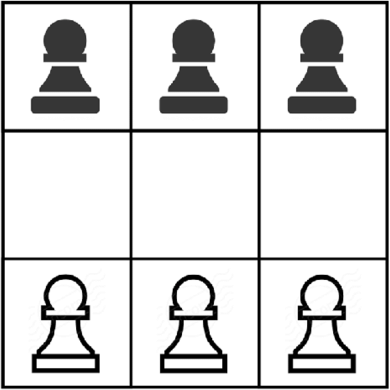

# Hexapawn

Inspired by Donald Michie’s [MENACE](https://en.wikipedia.org/wiki/Matchbox_Educable_Noughts_and_Crosses_Engine) reinforcement learning experiment, this project provides a simple Hexapawn environment for experimenting with decision-making and learning algorithms.

<!---->

---

  

## Gameplay

[Hexapawn](https://en.wikipedia.org/wiki/Hexapawn) is a two-player deterministic, zero-sum strategy game. Invented by Martin Gardner, it is a simplified version of Chess. Two players face off on a 3x3 board with 3 pawns each.

On each turn, a pawn must be advanced– either forward one square (if that square is empty) or diagonally forward one square (if that square is occupied by an enemy pawn) and capturing the enemy pawn.

The game is won when a pawn reaches the opposite side of the board (promotion) or the opponent has no legal moves to make.

---

## Features & Status

### Current
- Supports human v. human gameplay.
- Flexible API for integrating user-supplied AI agents. (see limitations below)
- Terminal-based interface for display and gameplay (for human players).
- Modular board size, allowing for play of Octopawn (or larger Hexapawn derivatives).

### Planned
- Support for human v. AI, and AI v. AI gameplay.
- GUI - improved visualization.

### Known Limitations
- **Testing**: This project has been manually tested through human gameplay, but lacks automated unit tests. Edge cases may not be fully covered.
- **AI Integration**: The agent loading mechanism has not been tested.
- **Board sizes**: Modular board sizes are supported but have only been tested with the standard 3×3 configuration.
---

## API

### Board Representation
- The board is represented from the White (Player 1) perspective as a row-major 2D array where `(row, col)` indexes start at `(0, 0)` in the top-left corner. 
- A string representation of the board is formed by flattening the array in row-major order— left to right within each row, starting from the top row.
  - In the case of a 3×3 board, there would be 9 characters, with the first position corresponding to the `(0, 0)` square and the last corresponding to `(2,2)`. 
  - Values in the representation:
    - `0` → unoccupied square
    - `1` → White (Player 1) pawn
    - `2` → Black (Player 2) pawn
  - Example: The board shown in the [image](#Hexapawn) above would be represented as:
  `222000111`

### ComputerPlayer Class
`ComputerPlayer(name: str, filepath: str)`

- **Description**: Represents a computer-controlled player in the Hexapawn environment.
- **Constructor Arguments**:
  - `name` (`str`): A name given to the agent player.
  - `filepath` (`str`): Path to the agent class implementation.

### Agent Interface
`get_move(board_state: str) -> ((from_row, from_col), (to_row, to_col))`

- **Requirement**: All custom agent classes **must** implement this method to be compatible with `ComputerPlayer`.
- **Description**: Given a board state, returns the move the agent chooses to make.
- **Arguments**:
  - `board_state` (`str`): Flattened string representation of the board (see [Board Representation](#board-representation) above)
- **Returns**:
  - (`tuple`): Two coordinates indicating the move: `((from_row, from_col), (to_row, to_col))`

Note: Future versions may add an additional argument to `get_move`— a list of legal moves (`list`) available from the given board state.

---

## Project Info
**Author:** T. Stratton  
**Start Date:** 1-NOV-2025  
**License:** MIT License – see [LICENSE](./LICENSE)  
**Language:** Python 3.11+ (tested on 3.11)  
**Status:** Alpha (early development)  
**Topics:** game, hexapawn, menace, ai, reinforcement-learning, machine-learning